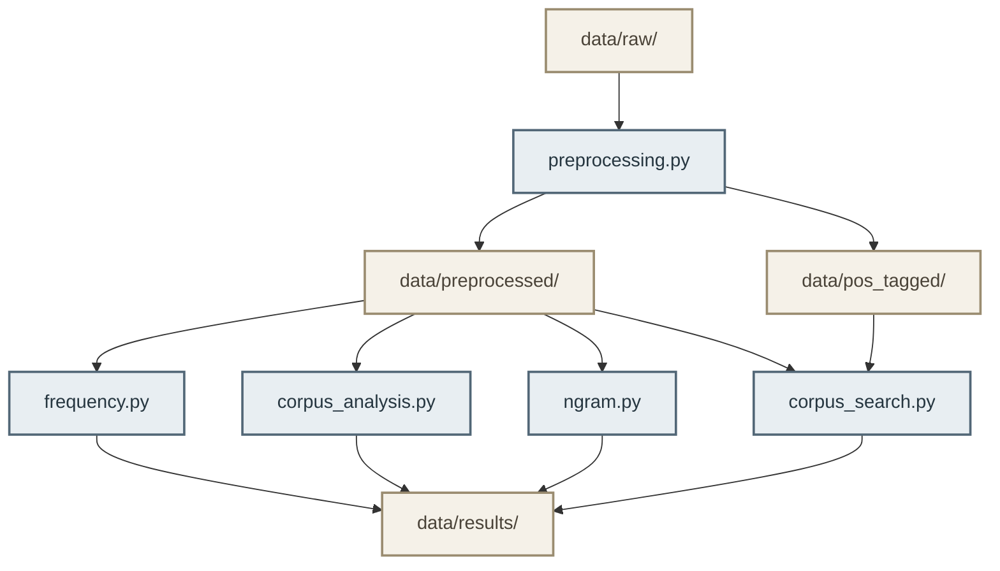

# **Corpus Linguistics Toolkit for Chinese**

## **1. Project Overview**
This project is a corpus linguistics toolkit written in Python for the analysis of Chinese corpora. It offers tools for corpus corpus preprocessing, corpus search, frequency analysis, collocation analysis, concordance/KWIC analysis and n-gram analysis.

## **2. Data Collection Approach**

The corpus was collected from the [China Digital Times (CDT)](https://chinadigitaltimes.net/chinese/) archive.

The crawler uses `Selenium` to access the CDT archive pages and collect article URLs, and `BeautifulSoup` to parse individual article pages. In the current implementation, URLs are collected from the first five archive pages. Articles without author information are excluded.

For each article, the crawler extracts the following metadata:

- `title`
- `source`
- `url`
- `author`
- `published`
- `genre`
- `topic`
- `copyright`
- `license`

The publication date is normalised to the `YYYY-MM-DD` format. The genre is recorded as `Online News Article`. When no topic can be extracted, the topic is recorded as `Unknown`.

The main article content is extracted from the `<article>` element, using its `h2`, `h3`, and `p` elements. Page-level metadata such as “所在分类(Category)” and “标签(Tag)”, as well as the “相关阅读” (Related Readings) section, are excluded from the corpus text.

`OpenCC` is used to convert Traditional Chinese characters, if any, to Simplified Chinese characters.

Each article is stored as a separate UTF-8 JSON file in `data/raw/`, with the article text and metadata stored separately. For example:

```json
{
  "id": "cdt_0149",
  "text": "...",
  "metadata": {
    "title": "...",
    "source": "China Digital Times",
    "url": "...",
    "author": "中国数字时代",
    "published": "2026-07-29",
    "genre": "Online News Article",
    "topic": "...",
    "copyright": "China Digital Times",
    "license": "CC BY-NC-SA 3.0"
  }
}
```

> *The `crawler.py` is provided in the toolkit for reference only and may require adaptation to different website layouts.*

## **3. Corpus Description**

The sample corpus consists of 159 Chinese-language online news articles collected from China Digital Times (CDT).

The corpus contains:

- **Documents:** 159
- **Tokens before stopword removal:** 340,277
- **Tokens after stopword removal:** 248,311

Each document is stored as an individual JSON file. The corpus contains both article text and structured metadata, including title, source, URL, author, publication date, genre, topic, copyright holder, and license.

The original content is licensed by China Digital Times under the [Creative Commons Attribution-NonCommercial-ShareAlike 3.0 Unported License (CC BY-NC-SA 3.0)](https://creativecommons.org/licenses/by-nc-sa/3.0/). The original copyright and licensing information is preserved in the metadata of each document.

The corpus data is provided as a sample dataset for research and educational purposes. Users should comply with the terms of the original CC BY-NC-SA 3.0 license when using or redistributing the corpus data.

## **4. System Architecture**

The toolkit is organized as a modular command-line pipeline. Each module
performs a specific corpus-processing or analysis task and operates on
JSON-formatted corpus data.

The overall workflow is:



### **Main Components**

- **`preprocessing.py`** – performs sentence segmentation, tokenisation,
  punctuation removal, stopword removal, and POS tagging. It generates
  both token-only and POS-tagged versions of the corpus.
- **`frequency.py`** – performs word and character frequency analysis and
  collocation analysis using statistical association measures.
- **`corpus_analysis.py`** – provides basic corpus information, TTR,
  concordance generation, and KWIC analysis.
- **`corpus_search.py`** – supports keyword, regular expression, and
  pos-based searches.
- **`ngram.py`** – performs unigram, bigram, and trigram analysis.


### **Data Flow**

The preprocessing module reads the raw JSON corpus stored in `data/raw/`, generates token-only data for general corpus analysis, saved in `data/preprocessed/`, and POS-tagged data, saved in `data/pos_tagged/`. 

> *POS tagging is included in the preprocessing module because the chosen tokenizer `jieba` (a lightweight and widely used tokenizer for Chinese language) conduct both tokenization and POS tagging through its `jieba.posseg` module at the same time.*

The *preprocessed* and *pos_tagged* data can then be independently processed by the analysis modules. Analysis results, including frequency tables, collocations,
search results, KWIC results, and N-gram statistics, are stored in `data/results/`.

## **5. Usage Instruction with Example Commands and Output**
See `installation.md` for installation instrucion.

### **General**
After installation, in your terminal, change directory to where your `data` folder is.
Then, you can run each module in the toolkit from the same directory.
For example, the path of my data folder is `A:\test\data\`, so I do:
```bash
cd A:\test\
```
To use each module, run:
```bash
python -m toolkit.[module_name]
```
For example, 
```bash
python -m toolkit.preprocessing
```
For each module, use `-h` or `--help` to see instructions for different options. 
```bash
python -m toolkit.preprocessing [-h]
```
Some modules require at least one option to run. See examples below.

### **Preprocessing (POS tagging included)**

```bash
python -m toolkit.preprocessing --license "CC BY-NC-SA 3.0" --genre "Online News Article" --topic 中国
```
> **Notes**: 
> 1. If no filtering options are used, all documents in `data/raw/` will be preprocessed by default.
> 2. Here, filtering uses partial matching rather than exact matching.
> 3. If your option parameters have white space, put them in quotation marks ("").
> 4. The stopword list used in preprocessing module is stored in `data/stopwords.json`. You can change the list according to your purpose.

<details>
<summary> click here to show example output </summary>

```text
--------------------------------------------------
> Number of documents: 159
--------------------------------------------------
> Filtering criteria:
| Topic: 中国
| Genre: Online News Article
| License: CC BY-NC-SA 3.0
--------------------------------------------------
> Number of documents after filtering: 12
--------------------------------------------------
> 89 stopwords loaded.
Stopwords: {'让', '一种', '还', '会', '从', '地', '最', '已经', '它', '其实', '像', '年', '多', '什么', '称', '但', '把', '于', '被', '到', '对', '那', '人', '这些', '没有', '要', '或者', '这', '很多', '却', '能', '不', '一些', '下', '之', '以', '中', '上', '和', '等', '而', '一', '其', '这种', '可能', '了', '这个', '日', '后', '或', '做', '已', '向', '甚至', '时', '去', '一个', '就是', '与', '的', '说', '也', '包括', '着', '很', '个', '都', '又', '这样', '但是', '是', '更', '可以', '并', '在', '因为', '通过', '不是', '有', '来', '该', '还是', '以及', '为', '月', '将', '就', '里', '给'}
--------------------------------------------------
> Tokenizing...
Building prefix dict from the default dictionary ...
Loading model from cache C:\Users\ma188\AppData\Local\Temp\jieba.cache
Loading model cost 0.726 seconds.
Prefix dict has been built successfully.
> Tokenization compeleted.
Total tokens: 23342
Total tokens after stopword removal: 17045
--------------------------------------------------
> Preprocessing completed.
Token-only documents saved to: data\preprocessed
POS-tagged documents saved to: data\pos_tagged
--------------------------------------------------
```

</details> 

### **Frequency Analysis**

```bash
python -m toolkit.frequency
```

<details>
<summary> click here to show example output </summary>

```text

```

</details> 

### **Corpus Analysis**

By default, it shows only basic document info and TTR result.
To include concordance analysis, use `--kwic`.

```bash
python -m toolkit.corpus_analysis --kwic 女性
```

<details>
<summary> click here to show example output </summary>

```text

```

</details> 

### **N-gram Analysis**
```bash
python -m toolkit.ngram
```

<details>
<summary> click here to show example output </summary>

```text

```

</details> 

### **Corpus Search**
```bash
python -m toolkit.corpus_search
```

<details>
<summary> click here to show example output </summary>

```text

```

</details> 


## **6. Challenges Faced**
- 一开始用request访问post archive，得到403 error，于是改用selenium
