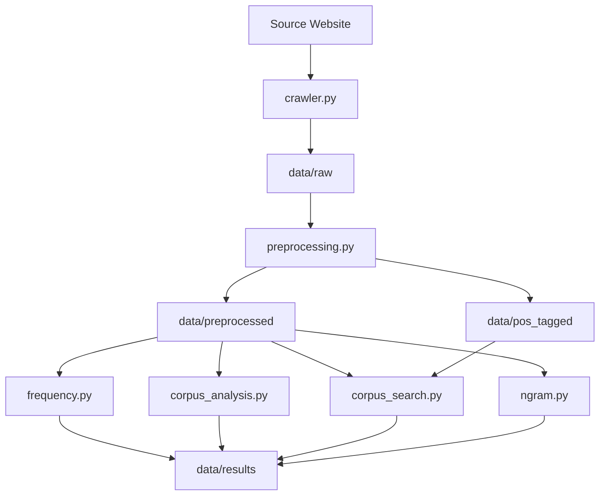

# Corpus Linguistics Toolkit for Chinese

## 1. Project Overview 
This project is a corpus linguistics toolkit written in Python for the analysis of Chinese corpora. It offers tools for corpus corpus preprocessing, corpus search, frequency analysis, collocation analysis, concordance/KWIC analysis and n-gram analysis.

## 2. Data Collection Approach 
The corpus was collected from the [China Digital Times (CDT) archive](https://chinadigitaltimes.net/chinese/) .

The crawler uses `Selenium` to access the archive pages and collect article URLs, and `BeautifulSoup` to extract article content and metadata from individual pages. Articles without author information are excluded.

For each article, the crawler extracts the `title`, `author`, `source`, `publication date`, `topic`, and `URL`. The main article text is extracted from the element. Website metadata and the “相关阅读” (Related Readings) section are excluded.

`OpenCC` is used to convert Traditional Chinese characters, if any, to Simplified Chinese characters. 

Each article is stored as a separate UTF-8 JSON file with metadata in data/raw/.

The toolkit includes `crawler.py` as a reference implementation. It is intended for reference rather than direct reuse, as web scraping code generally needs to be adapted to the structure and layout of the target website.
> **Note:** The `crawler.py` is provided for reference only and may require adaptation to different website layouts.

## 3. Corpus Description
The sample corpus consists of 159 online news articles written in Mandarin Chinese, with 340,277 tokens before stopword removal and 248,311 tokens after stopword removal.

The original content is licensed by China Digital Times under the Creative Commons Attribution-NonCommercial-ShareAlike 3.0 Unported License (CC BY-NC-SA 3.0). The copyright and licensing information of the articles is preserved in the metadata.

## 4. System Architecture
### 4.1. preprocessing

## 4. System Architecture

The toolkit is organized as a modular command-line pipeline. Each module
performs a specific corpus-processing or analysis task and operates on
JSON-formatted corpus data.

The overall workflow is:

Raw corpus
→ Preprocessing
→ Processed corpus
→ Corpus analysis / Frequency analysis / Corpus search / N-gram analysis
→ Analysis results



### Main Components

- `crawler.py` – collects and stores raw corpus documents and metadata.
- `preprocessing.py` – performs sentence segmentation, tokenisation,
  punctuation removal, stopword removal, and POS tagging. It generates
  both token-only and POS-tagged versions of the corpus.
- `frequency.py` – performs word and character frequency analysis and
  collocation analysis using statistical association measures.
- `corpus_analysis.py` – provides basic corpus information, TTR,
  concordance generation, and KWIC analysis.
- `corpus_search.py` – supports keyword, regular expression, and
  pos-based searches.
- `ngram.py` – performs unigram, bigram, and trigram analysis.


### Data Flow

The `crawler` produces the raw JSON corpus stored in `data/raw/`, which is passed to the `preprocessing` module. 

The `preprocessing` module generates token-only data for general corpus analysis, saved in `data/preprocessed/`, and POS-tagged data, saved in `data/pos_tagged/`. 

<sub>POS tagging is included in the preprocessing module because the chosen tokenizer `jieba` (a lightweight and widely used tokenizer for Chinese language) conduct both tokenization and POS tagging through its `jieba.posseg` module at the same time. </sub>

The *preprocessed* and *pos_tagged* data can then be independently processed by the analysis modules. Analysis results, including frequency tables, collocations,
search results, KWIC results, and N-gram statistics, are stored in `data/results/`.

## 5. Usage Instruction with Example Commands and Output

### 5.1. preprocessing (POS tagging included)
optionally with document filtering based on metadata parameter(s):

```bash
python -m Toolkit.preprocessing --license "CC BY-NC-SA 3.0" --genre "Online News Article"
```

> [!NOTE]
> Note: If your parameter has white space, put it in quotation marks "".

### 5.2. frequency analysis

```bash
python -m Toolkit.frequency
```

### 5.3. corpus analysis

```bash
python -m Toolkit.corpus_analysis
```

By default, it shows only basic document info and TTR result.

```
Token count: 340277
Type count: 23681
TTR: 0.13
```

Use `--kwic` to include concordance analysis.

```bash
python -m Toolkit.corpus_analysis --kwic 女性
```

### 5.4. corpus search
```bash
python -m Toolkit.corpus_search
```
### 5.5. N-gram analysis
```bash
python -m Toolkit.ngram
```

## 6. Challenges Faced
text

## 7. License

### Source Code

The source code of this project is released under the MIT License.
See the `LICENSE` file for details.

### Corpus Data

The corpus data collected from China Digital Times (CDT) is subject to
the original license of the source website.

China Digital Times states that its original content is licensed under the
Creative Commons Attribution-NonCommercial-ShareAlike 3.0 Unported License
(CC BY-NC-SA 3.0).

Source:
https://chinadigitaltimes.net/chinese/

License:
https://creativecommons.org/licenses/by-nc-sa/3.0/

The corpus data is provided for research and educational purposes.
Users should comply with the terms of the original CC BY-NC-SA 3.0 license.