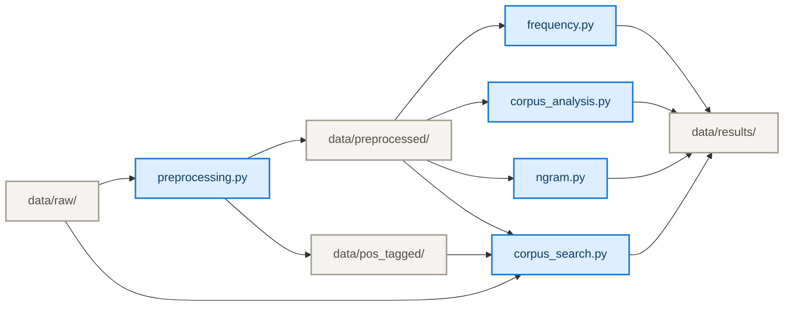

# **Corpus Linguistics Toolkit for Chinese**
A Python-based toolkit for collecting, preprocessing, searching, and analyzing Chinese-language corpora.

## **Table of Contents**

1. [Project Overview](#1-project-overview)
2. [Data Collection](#2-data-collection)
3. [Corpus Description](#3-corpus-description)
4. [System Architecture](#4-system-architecture)
5. [Usage Instructions and Example Commands](#5-usage-instructions-and-example-commands)
   - [5.1 Preprocessing](#51-preprocessing)
   - [5.2 Frequency Analysis](#52-frequency-analysis)
   - [5.3 Corpus Analysis](#53-corpus-analysis)
   - [5.4 N-gram Analysis](#54-n-gram-analysis)
   - [5.5 Corpus Search](#55-corpus-search)
6. [Challenges Faced](#6-challenges-faced)

## **1. Project Overview**

This project is a Python-based corpus linguistics toolkit for analyzing Chinese corpora. It provides tools for corpus preprocessing, corpus search, frequency analysis, collocation analysis, concordance/KWIC analysis, and n-gram analysis.

## **2. Data Collection**

The corpus was collected from the [China Digital Times (CDT)](https://chinadigitaltimes.net/chinese/) archive.

The crawler uses `Selenium` to access the [CDT archive pages](https://chinadigitaltimes.net/chinese/post-archives) and collect article URLs, and `BeautifulSoup` to parse individual article pages. In the current implementation, URLs are collected from the first five archive pages. Articles without author information are excluded.

For each article, the crawler extracts the following metadata: `title`, `source`, `url`, `author`, `published`, `genre`, `topic`, `copyright`, and `license`.

The publication date is normalized to the `YYYY-MM-DD` format. The genre is recorded as `Online News Article`. If no topic can be extracted, it is recorded as `Unknown`.

The main article content is extracted from the `<article>` element by collecting its `<h2>`, `<h3>`, and `<p>` elements. Page-level metadata such as “所在分类” (Category) and “标签” (Tag), as well as the “相关阅读” (Related Readings) section, are excluded from the corpus text.

`OpenCC` is used to convert Traditional Chinese characters, if any, to Simplified Chinese characters.

Each article is stored as a separate UTF-8 JSON file in `data/raw/`.

> **Note:**
> `crawler.py` is included in the toolkit for reference only and may require adaptation for different website layouts.

## **3. Corpus Description**

The sample corpus consists of 159 original Chinese-language articles published by China Digital Times between September 29, 2025 and August 17, 2026.

> **Corpus Size**
>
> **159** documents  
> **340,277** tokens before stopword removal  
> **248,311** tokens after stopword removal

Each document is stored as an individual JSON file. The corpus contains both article text and structured metadata. For example:

```json
{
  "id": "cdt_0149",
  "text": "...",
  "metadata": {
    "title": "...",
    "source": "China Digital Times",
    "url": "...",
    "author": "中国数字时代",
    "published": "2026-07-29",
    "genre": "Online News Article",
    "topic": "...",
    "copyright": "China Digital Times",
    "license": "CC BY-NC-SA 3.0"
  }
}
```
### **Disclaimer**

This corpus was collected and processed for this project and is not an official dataset published by China Digital Times. The corpus is provided for research and educational purposes. Users are responsible for complying with the terms of the original [CC BY-NC-SA 3.0 license](https://creativecommons.org/licenses/by-nc-sa/3.0/) and any other applicable terms when using or redistributing the corpus.

## **4. System Architecture**

The toolkit is organized as a modular command-line pipeline. Each module performs a specific corpus-processing or analysis task and operates on JSON-formatted corpus data.


<p align="center">
  <sub>Overall workflow of the toolkit</sub>
</p>

### **Main Components**

* **`preprocessing.py`** – performs sentence segmentation, tokenization, punctuation removal, stopword removal, and POS tagging.
* **`frequency.py`** – performs word and character frequency analysis and collocation analysis using statistical association measures.
* **`corpus_analysis.py`** – provides basic corpus information, TTR, concordance generation, and KWIC analysis.
* **`ngram.py`** – performs unigram, bigram, and trigram analysis.
* **`corpus_search.py`** – supports keyword, regular expression, and POS-based searches.

### **Data Flow**

The preprocessing module reads the raw JSON corpus from `data/raw/`, generates token-only data for general corpus analysis, and saves it to `data/preprocessed/`. It also generates POS-tagged data and saves it to `data/pos_tagged/`.

The preprocessed and POS-tagged data can then be processed independently by the analysis modules. Analysis results, including frequency tables, collocations, search results, KWIC results, and n-gram statistics, are stored in `data/results/`.

> **Note:**
> POS tagging is included in the preprocessing module because the chosen tokenizer, `jieba`, performs tokenization and POS tagging together through its `jieba.posseg` module.

## **5. Usage Instructions and Example Commands**

> **Note:**
> See `installation.md` for installation instructions.

After installation, change the working directory in the terminal to the directory containing the `data` folder.

For example, if the `data` folder is located at `D:/Documents/test/data/`:

```bash
cd D:/Documents/test/
```

All toolkit modules can then be run from the same directory.

The general command format is:

```bash
python -m toolkit.[MODULE_NAME]
```

For example:

```bash
python -m toolkit.preprocessing
```

Use `-h` or `--help` with any module to view the available options.

```bash
python -m toolkit.preprocessing -h
```

---

### **5.1 Preprocessing (POS Tagging Included)**

The **`preprocessing`** module performs sentence segmentation, tokenization, POS tagging, punctuation removal, and stopword removal. It saves both token-only and POS-tagged versions of the preprocessed corpus.

By default, all documents in `data/raw/` are preprocessed:

```bash
python -m toolkit.preprocessing
```

The corpus can be filtered by metadata using any combination of the following options:

`--source`, `--author`, `--topic`, `--genre`, and `--license`.

For example:

```bash
python -m toolkit.preprocessing --license "CC BY-NC-SA 3.0" --genre "Online News Article" --topic 中国
```

<details>
<summary>Click here to show example output</summary>

```text
--------------------------------------------------
> Number of documents: 159
--------------------------------------------------
> Filtering criteria:
| Topic: 中国
| Genre: Online News Article
| License: CC BY-NC-SA 3.0
--------------------------------------------------
> Number of documents after filtering: 12
--------------------------------------------------
> 89 stopwords loaded.
Stopwords: {'之', '说', '着', '而', '这种', '下', '个', '很', '月', '但是', '甚至', '可以', '也', '日', '把', '对', '但', '或', '等', '还是', '为', '就是', '一个', '一种', '给', '又', '是', '已', '被', '到', '这些', '其', '和', '不', '将', '地', '与', '该', '上', '或者', '通过', '在', '会', '去', '却', '并', '可能', '没有', '了', '以及', '来', '这样', '后', '很多', '人', '什么', '因为', '时', '最', '于', '其实', '向', '要', '里', '能', '像', '已经', '多', '一些', '年', '包括', '做', '有', '都', '从', '让', '以', '还', '更', '它', '不是', '一', '的', '这个', '称', '就', '那', '这', '中'}
--------------------------------------------------
> Tokenizing...
Building prefix dict from the default dictionary ...
Loading model from cache C:\Users\ma188\AppData\Local\Temp\jieba.cache
Loading model cost 0.603 seconds.
Prefix dict has been built successfully.
> Tokenization completed.
Total tokens: 23342
Total tokens after stopword removal: 17045
--------------------------------------------------
> Preprocessing completed.
> Token-only documents saved to: data\preprocessed
> POS-tagged documents saved to: data\pos_tagged
--------------------------------------------------
```

</details>

> **Notes:**
> * Metadata filtering uses **partial matching** rather than exact matching.
> * If an option parameter contains **whitespace**, enclose the parameter in quotation marks `""`.
> * The **stopword** list used by this module is stored in `data/stopwords.json`. The list can be modified according to the research purpose.

---

### **5.2 Frequency Analysis**

The **`frequency`** module calculates word and character frequencies and provides visualizations of the most frequent items. It also performs collocation analysis using Mutual Information (MI), t-score, Dice coefficient, and log-likelihood.

By default, the top 20 results are displayed in the terminal for each frequency and collocation analysis. The number of displayed results can be changed using `--show`.

> **Note:**
> The `--show` option only affects the number of results displayed in the terminal. It does not affect the analysis results. The complete results are always saved in the corresponding JSON files.

Example:

```bash
python -m toolkit.frequency --show 5
```

<details>
<summary>Click here to show example output</summary>

```text
--------------------------------------------------
Number of documents: 159
Number of tokens: 248311
Number of word types: 29995
--------------------------------------------------
1. frequency analysis
--------------------------------------------------
----------------------------------------
> Top 5 most frequent words:
----------------------------------------
中国 2935
我 1887
我们 1253
报告 1031
你 1028
----------------------------------------
> Top 5 most frequent characters:
----------------------------------------
国 6526
2 5326
一 4792
中 4657
人 4330
--------------------------------------------------
2. collocation analysis
--------------------------------------------------
------------------------------
> Top 5 collocations by MI:
------------------------------
Safeguard Defenders freq= 5 MI= 15.6
叶 丰华 freq= 5 MI= 15.6
谍龟 谍鱼 freq= 5 MI= 15.6
Lingua Sinica freq= 5 MI= 15.6
赛默 飞世尔 freq= 5 MI= 15.6
----------------------------------------
> Top 5 collocations by t-score:
----------------------------------------
中国 数字 freq= 375 t-score= 19.057
数字 时代 freq= 336 t-score= 18.278
我 觉得 freq= 307 t-score= 17.321
报告 指出 freq= 140 t-score= 11.659
户 晨风 freq= 136 t-score= 11.655
----------------------------------------
> Top 5 collocations by Dice:
----------------------------------------
菲尔 兹 freq= 12 Dice= 1.0
瓦赫坦 戈夫 freq= 22 Dice= 1.0
叶甫盖 尼 freq= 7 Dice= 1.0
Safeguard Defenders freq= 5 Dice= 1.0
Wi Fi freq= 7 Dice= 1.0
----------------------------------------
> Top 5 collocations by log-likelihood:
----------------------------------------
数字 时代 freq= 336 LL= 3935.071
中国 数字 freq= 375 LL= 3106.74
我 觉得 freq= 307 LL= 2745.177
户 晨风 freq= 136 LL= 2006.317
404 文库 freq= 133 LL= 1828.399
--------------------------------------------------
> Frequency analysis completed.
> Collocation results saved to: data\results\collocations.json
> Ranked collocation results saved to: data\results\collocations_ranked.json
--------------------------------------------------
```

</details>

---

### **5.3 Corpus Analysis**

The **`corpus_analysis`** module provides basic corpus statistics, TTR, concordance analysis, and KWIC analysis.

By default, it displays the TTR result only. To perform concordance and KWIC analysis, use `--kwic` followed by a keyword. The terminal displays the top 20 KWIC results by default. The number of displayed results can be changed using `--show`.

Example:

```bash
python -m toolkit.corpus_analysis --kwic 女性 --show 5
```

<details>
<summary>Click here to show example output</summary>

```text
------------------------------
Number of documents: 159
------------------------------
> Token-Type Ratio (TTR)
------------------------------
Tokens: 248311
Types: 29995
TTR: 0.121
------------------------------
> Concordance Analysis
------------------------------
Keyword: 女性
Number of occurrences: 220
KWIC results:
--------------------------------------------------------------------------------
发生 父系社会 反而 全部 发生              女性          解放 时代 载人 航天 互联网
互联网 人工智能 重大 科技进步 发生           女性          地位 不断 提高 原有 性别
社交 软件 群组 针对 德华                女性          实施 系统性 迷奸 偷拍 传播
参与 宣传 一位 年轻 维吾尔族              女性          指示 回去 你 美好 经历
由此 成为 该奖 历史 第三位               女性          得主 二人 曾 北京大学 2007
--------------------------------------------------------------------------------
> Corpus analysis completed.
> Concordance results saved to: data\results\concordance_results.json
> KWIC results saved to: data\results\kwic_results.json
--------------------------------------------------------------------------------
```

</details>

---

### **5.4 N-gram Analysis**

The **`ngram`** module performs n-gram frequency analysis.

By default, it analyzes unigrams, bigrams, and trigrams and displays the top 20 results for each. The n-gram size(s) can be specified using `--ngram`. Multiple n-gram sizes can be specified in a single command. The number of displayed results can be changed using `--show`.

Example:

```bash
python -m toolkit.ngram --ngram 3 4 --show 5
```

<details>
<summary>Click here to show example output</summary>

```text
------------------------------
Number of documents: 159
Total tokens: 248311
------------------------------
> Top 5 Trigram frequencies:
------------------------------
中国 数字 时代 freq= 336
CDT 报告 汇 freq= 79
数字 时代 404 freq= 63
时代 404 文库 freq= 59
报告 汇 栏目 freq= 53
------------------------------
> Top 5 4-gram frequencies:
------------------------------
中国 数字 时代 404 freq= 63
数字 时代 404 文库 freq= 59
CDT 报告 汇 栏目 freq= 53
报告 汇 栏目 收录 freq= 49
汇 栏目 收录 中国 freq= 49
--------------------------------------------------
> N-gram analysis completed.
> N-gram results saved to: data\results\ngram_results.json
--------------------------------------------------
```

</details>

---

### **5.5 Corpus Search**

The **`corpus_search`** module supports keyword, regular expression, and part-of-speech (POS) searches.

The three search methods are independent and can be used separately or together. By default, the terminal displays the top 20 results. The number of displayed results can be changed using `--show`.

Example:

```bash
python -m toolkit.corpus_search --keyword 女性 --regex "女.+" --pos ns --show 5
```

<details>
<summary>Click here to show example output</summary>

```text
--------------------------------------------------
Corpus for keyword & regex search: data/preprocessed/
Corpus for POS search: data/pos_tagged/
Number of documents: 159
--------------------------------------------------
> Keyword search: 女性
--------------------------------------------------
Number of results: 220
{'document_id': 'cdt_0031', 'position': 2044, 'token': '女性'}
{'document_id': 'cdt_0031', 'position': 2054, 'token': '女性'}
{'document_id': 'cdt_0031', 'position': 2247, 'token': '女性'}
{'document_id': 'cdt_0035', 'position': 350, 'token': '女性'}
{'document_id': 'cdt_0114', 'position': 89, 'token': '女性'}
--------------------------------------------------
> Regex search: 女.+
--------------------------------------------------
Number of results: 472
{'document_id': 'cdt_0031', 'position': 2044, 'token': '女性'}
{'document_id': 'cdt_0031', 'position': 2054, 'token': '女性'}
{'document_id': 'cdt_0031', 'position': 2247, 'token': '女性'}
{'document_id': 'cdt_0035', 'position': 350, 'token': '女性'}
{'document_id': 'cdt_0075', 'position': 515, 'token': '子女教育'}
--------------------------------------------------
> POS search: POS = ns
--------------------------------------------------
Number of results: 8832
{'document_id': 'cdt_0031', 'position': 17, 'token': '中国', 'pos': 'ns'}
{'document_id': 'cdt_0031', 'position': 50, 'token': '中国', 'pos': 'ns'}
{'document_id': 'cdt_0031', 'position': 85, 'token': '中国', 'pos': 'ns'}
{'document_id': 'cdt_0031', 'position': 96, 'token': '中国', 'pos': 'ns'}
{'document_id': 'cdt_0031', 'position': 105, 'token': '中国', 'pos': 'ns'}
--------------------------------------------------
> Corpus search completed.
> Search results saved to: data\results\search_results.json
--------------------------------------------------
```

</details>

> **Notes:**
>
> * POS tags and their meanings are listed in `data/pos_tagset.txt`.
> * `--raw` can be used together with `--keyword` and/or `--regex` to search the original, unprocessed text in `data/raw/`.
> * `--pos` cannot be used with `--raw`, as POS tags are only available for the preprocessed corpus.

## **6. Challenges Faced**

Several challenges were encountered during data collection, preprocessing, and corpus analysis:

- **Choosing the data source.** The initial attempt used Chinese Wikipedia pages. However, collecting a sufficiently large and systematic corpus from Wikipedia was less straightforward because there was no suitable archive page for efficiently retrieving article URLs. China Digital Times (CDT) was therefore selected as the final data source because its archive pages provide a convenient way to systematically collect article URLs using `Selenium`.

- **Chinese character normalization.** During the initial experiments with Chinese Wikipedia pages, simplified and traditional Chinese characters were sometimes mixed. `OpenCC` was therefore introduced to convert the text to a consistent Chinese variety. Although no obvious simplified/traditional Chinese mixing was observed in the later CDT corpus, the `OpenCC` normalization step was retained to reduce the risk of mixed character forms affecting corpus statistics.

- **Accessing the CDT archive.** The initial approach used `requests` to access the CDT archive, but the requests returned a `403 Forbidden` error. `Selenium` was therefore adopted to access the archive pages and retrieve the article URLs, while `BeautifulSoup` was used for subsequent HTML parsing and content extraction.

- **Extracting article content from the webpage structure.** Identifying the appropriate HTML elements for article extraction required inspecting the structure of the target pages. The final extraction procedure uses the `<article>` element as the main content container and collects its `<h2>`, `<h3>`, and `<p>` elements. Additional cleaning was also required to remove irrelevant webpage content and formatting noise.

- **Extracting metadata reliably.** Metadata extraction initially relied on regular expressions. However, the patterns could sometimes capture unwanted text in addition to the intended metadata. The extraction was subsequently constrained to the relevant HTML field, making the process more reliable for fields such as author information and modification dates.

- **Validating automatically collected data.** Because the corpus was collected automatically from web pages, extraction errors were not always immediately apparent. Intermediate outputs and corpus statistics were therefore inspected to identify problems such as empty extractions, unusually long sentences, and inconsistencies between preprocessing stages.

- **Sentence segmentation.** Initially, sentence segmentation was based only on sentence-final punctuation (`[。！？!?]`). However, inspection of unusually long sentences showed that some source articles used line breaks without sentence-final punctuation. `[\r\n]` was therefore added as an additional sentence boundary. Some complex cases, such as direct quotations, can still result in a closing quotation mark being assigned to the following sentence when the quotation mark follows the sentence-final punctuation. Since punctuation is removed in a later preprocessing step and this issue does not affect token-level analysis, no further rule was introduced to handle this edge case.

- **Keeping tokenization and POS tagging aligned.** POS tagging was initially considered as a separate preprocessing stage. However, `jieba.posseg` performs tokenization and POS tagging together. Applying it to an already tokenized corpus could introduce another round of tokenization and potentially result in a mismatch between the preprocessed and POS-tagged tokens. Therefore, `preprocessing.py` generates both preprocessed and POS-tagged versions of the corpus, which are stored separately in their corresponding directories.

- **Displaying Chinese characters in visualizations.** Matplotlib's default font settings did not reliably support Chinese characters in plots. A Chinese-compatible font (`Microsoft YaHei`) was therefore configured for visualizations.

- **Understanding collocation statistics.** Different collocation measures were initially unfamiliar, particularly their statistical interpretation and differences. Course materials and explanations from the course instructor were used to understand the measures and determine how they should be incorporated into the toolkit.

---

***Final Note:***  
*<sub>This is the end of this lengthy README. I doubt anyone would actually read this far, but anyway...</sub>*  
*kudos to the CDT team for keeping an interesting corner of the Simplified Chinese internet alive <3*